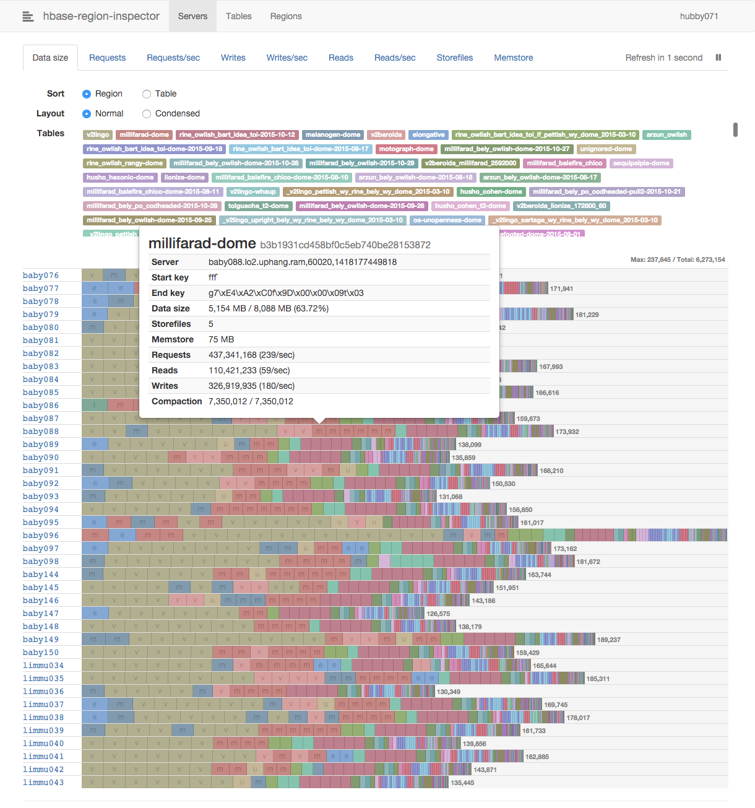

# hbase-region-inspector



## Usage

```
usage: hbase-region-inspector [OPTIONS] ┌ QUORUM[/ZKPORT] ┐ PORT [INTERVAL]
                                        └ CONFIG_FILE     ┘
  Options
    --admin       Enable drag-and-drop interface
    --no-system   Hide system tables
```

To access a secured HBase cluster, you have to prepare the following
configuration files:

- The main properties file
- JAAS login configuration
- Kerberos configuration (usually `/etc/krb5.conf`)
- Kerberos keytab (optional, but recommended)

You can find the examples in [conf-examples](conf-examples/).

## Prerequisites

- [NPM](https://www.npmjs.com/)
- [Leiningen](https://github.com/technomancy/leiningen)

```sh
brew install npm leiningen
```

## Development

```sh
# For HBase 0.98 and above
./hacking

# HBase 0.94 (CDH4)
./hacking cdh4
```

## Build

```sh
# For HBase 0.98 and above
make

# HBase 0.94 (CDH4)
make profile=cdh4
```

## License

[MIT](LICENSE)
